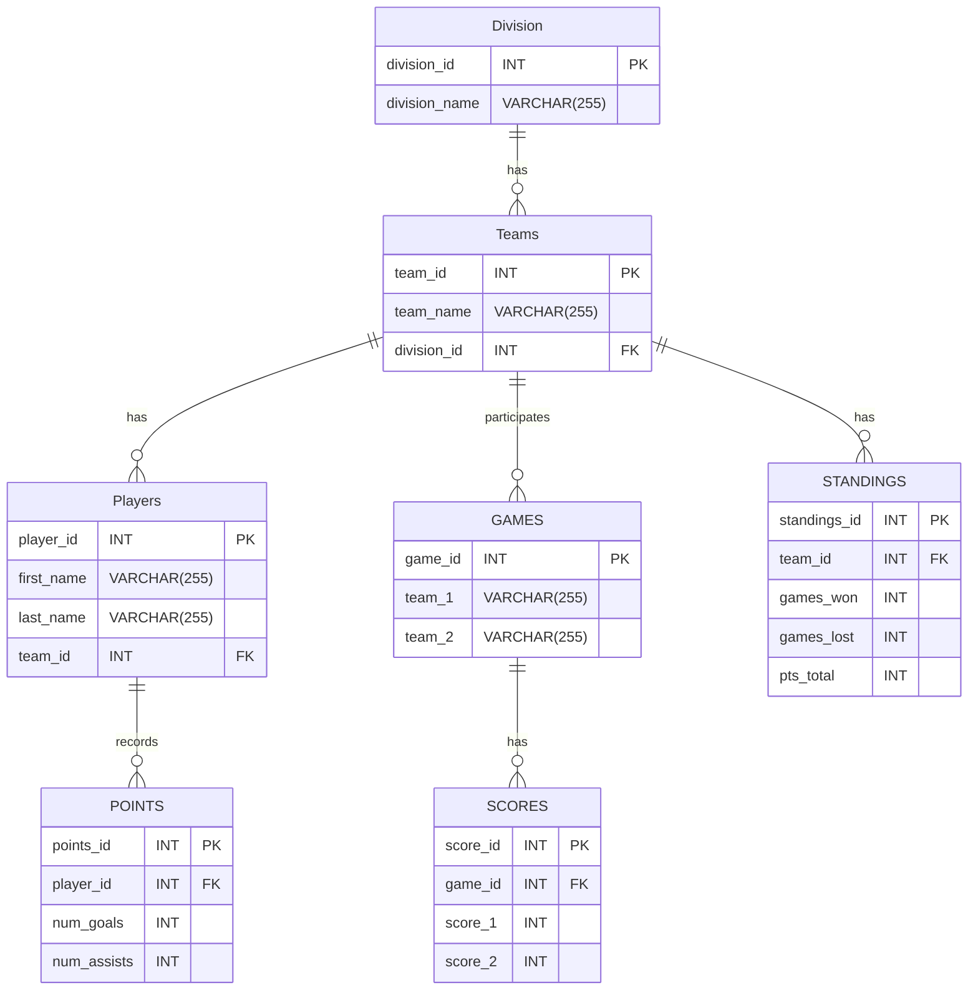

# Application Architecture Plan & ER Model
## Problem 
A group of people want to get together and start a pick-up hockey league. They want the league to feel realistic and want a way to track teams and players. This project aims to create a database for such a scenario and the details below provide a high-level view. 

## Architecture 
For the purposes of this project, Google Colab was used to construct a Jupyter notebook that created a website (GUI) for running and viewing queries. The HTML template and the SQL database file that were necessary to create the webiste were sourced from my github. 

## ER Diagram

The following ER diagram represents the database structure for the league. It includes the following entities: Division, Teams, Players, Games, Scores, Points, and Standings along with their relationships. 

