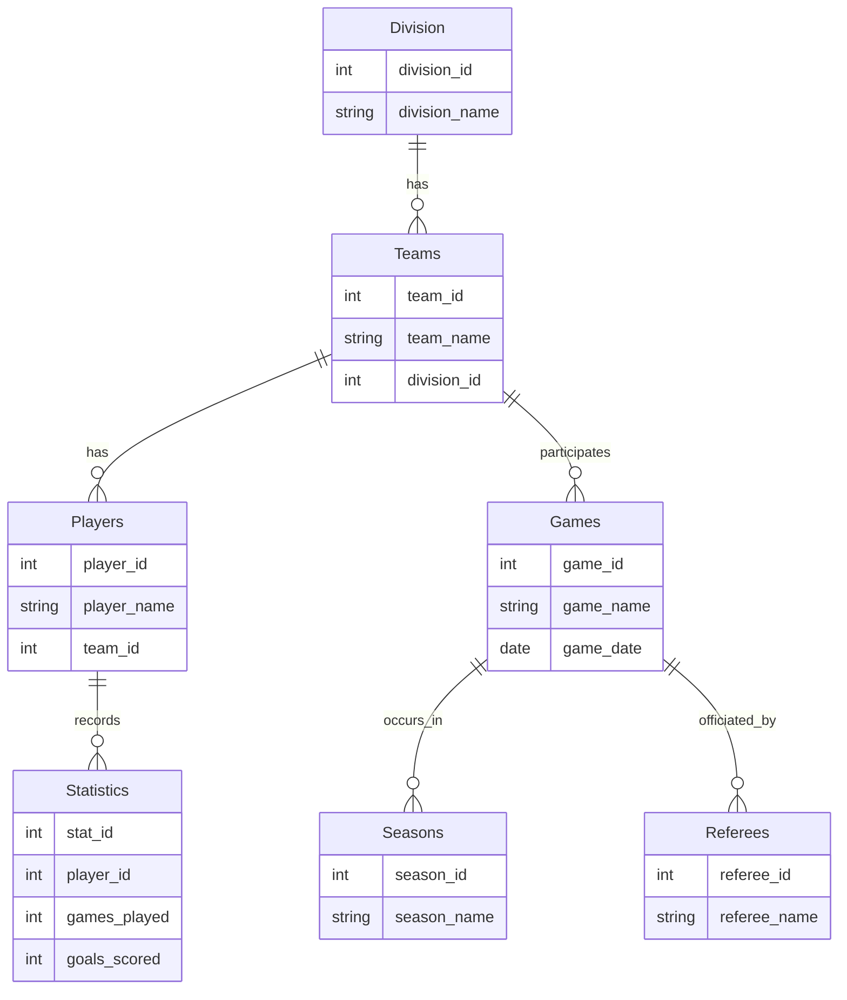

# Application Architecture Plan & ER Model
## Problem 
A group of people want to get together and start a pick-up hockey league. They want the league to feel realistic and want a way to track teams and players. This project aims to create a database for such a scenario. 

## Architecture 
It is possible for a two-tier or a three-tier approach for this project. The two-tier provides more simplicity while the three-tier would be more complex but could be used for a web-based applicaition for the league. 

## ER Diagram

The following ER diagram represents the database structure for the league. It includes the following entities: Division, Teams, Games, Players, Seasons, Statistics, and Referees along with their relationships. 

